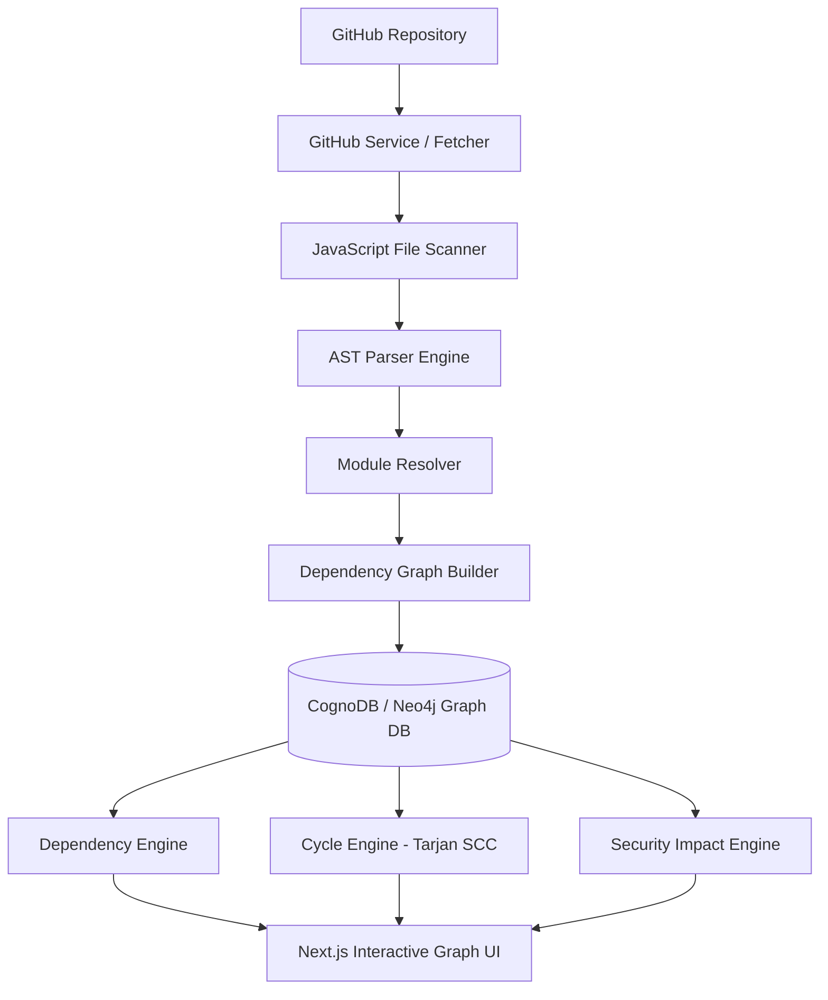
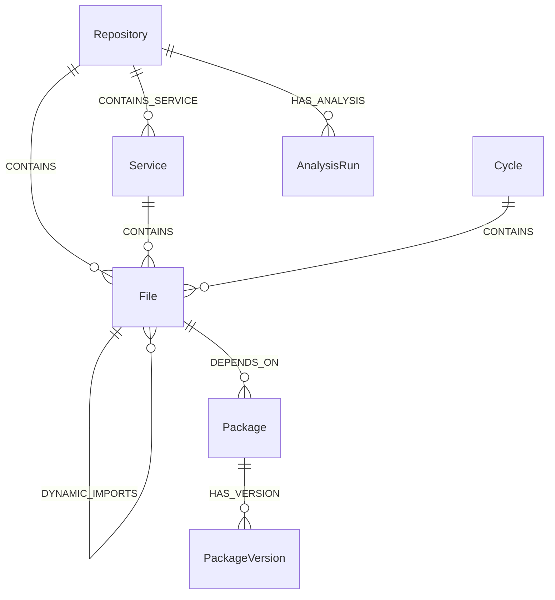

# NodeAtlas — Node.js Dependency Intelligence & Security Graph

**NodeAtlas** is a production-quality SaaS application that connects to a user's GitHub repository, analyzes its JavaScript/Node.js codebase, builds a persistent dependency graph in CognoDB, and provides three primary analysis modes: **Dependency Explorer**, **Cycle Analyzer**, and **Security Impact Analyzer**.

The graph database is the core product powering all intelligence modes, answering:
- **Dependencies:** What uses file X? What does file X depend on? What are the dependency paths?
- **Cycles:** Where are circular dependencies? What is the complete loop `A → B → C → A`?
- **Security Impact:** If a user enters a package or service name as potentially infected/vulnerable, which downstream files and microservices depend on it, and what is the complete exposure graph?

---

## 🏗 System Architecture



---

## 📊 Graph Data Model

NodeAtlas models Node.js codebases as directed graphs:



### Nodes & Relationships
- `(:User)-[:OWNS]->(:Repository)`
- `(:Repository)-[:CONTAINS]->(:File)`
- `(:Repository)-[:CONTAINS_SERVICE]->(:Service)`
- `(:Service)-[:CONTAINS]->(:File)`
- `(:File)-[:IMPORTS | :REQUIRES | :DYNAMIC_IMPORTS]->(:File)`
- `(:File)-[:DEPENDS_ON]->(:Package)`
- `(:Package)-[:HAS_VERSION]->(:PackageVersion)`
- `(:Cycle)-[:CONTAINS]->(:File)`

---

## 🚀 Key Features & Modes

### 1. Dependency Explorer (`/explorer`)
- Interactive 1, 2, and 3-hop directed module graph exploration powered by React Flow.
- Search and filter by Node Type (`File`, `Package`, `Service`).
- View metadata, node relationships, import types, and line numbers.

### 2. Cycle Analyzer (`/cycles`)
- Powered by Tarjan's Strongly Connected Components (SCC) algorithm.
- Identifies exact cycle loops (e.g., `user-service.js → user-model.js → user-validator.js → user-service.js`).
- Allows opening any cycle in a focused visual sub-graph with loop edges highlighted.

### 3. Security Impact Mode (`/security`)
- Input-driven dependency exposure analyzer for package, service, or file targets.
- Performs reverse multi-hop graph traversals to calculate exposure depth.
- Displays metrics on affected files, microservices, and dependency paths.
- Uses clear framing around *"potentially affected"* / *"dependency exposure"* rather than claiming exploitability proof.

### 4. Packages View (`/packages`)
- Complete inventory of external npm packages extracted from static imports and `package.json` / `package-lock.json`.
- In-repo usage counts and direct links to Security Impact analysis.

---

## ⚡ Parameterized Cypher Queries

### Repository Multi-hop Graph Traversal
```cypher
MATCH (r:Repository {id: $repoId})-[:CONTAINS]->(f:File)
OPTIONAL MATCH (f)-[r_dep:IMPORTS|REQUIRES|DYNAMIC_IMPORTS]->(f2:File)
OPTIONAL MATCH (f)-[r_pkg:DEPENDS_ON]->(p:Package)
OPTIONAL MATCH (s:Service {repositoryId: $repoId})-[:CONTAINS]->(f)
RETURN f, r_dep, f2, r_pkg, p, s
```

### Security Target Multi-hop Reverse Traversal
```cypher
MATCH (p:Package {id: $packageName})<-[:DEPENDS_ON]-(f:File)<-[:IMPORTS|REQUIRES*1..5]-(dependentFile:File)
OPTIONAL MATCH (s:Service)-[:CONTAINS]->(dependentFile)
RETURN p, f, dependentFile, s
```

---

## 💻 Developer Guide & Local Setup

### Prerequisites
- Node.js `v18+` or `v20+`
- npm `v9+`

### Installation & Running Locally

1. **Clone and Install Dependencies**
   ```bash
   git clone <repo-url>
   cd nodeatlas
   npm install
   ```

2. **Configure Environment Variables** (Optional, defaults to high-performance in-memory graph store if database URI is omitted):
   ```env
   COGNODB_URI=bolt://localhost:7687
   COGNODB_USER=neo4j
   COGNODB_PASSWORD=password
   GITHUB_TOKEN=ghp_your_github_personal_access_token
   ```

3. **Run Unit & Integration Tests**
   ```bash
   npm test
   ```

4. **Start Development Server**
   ```bash
   npm run dev
   ```
   Open `http://localhost:3000` in your browser.

5. **Build for Production**
   ```bash
   npm run build
   npm run start
   ```

---

## 🧪 Demo Repository Included

NodeAtlas includes an embedded, realistic JavaScript microservices demo repository (`demo-repo/` / `ecommerce-microservices-demo`) containing:
- ~35 JavaScript source files across multiple service boundaries (`auth`, `users`, `orders`, `payments`, `utils`).
- 3 intentional circular dependency loops for cycle testing.
- Multiple external npm packages (`express`, `lodash`, `axios`, `dotenv`).

---

## 📌 Honest Limitations & Roadmap

### Initial MVP Scope Limitations
- **JavaScript Only:** Analyzes `.js`, `.mjs`, and `.cjs` files.
- **Static Analysis Only:** Repository code is **never executed** during analysis. Dynamic imports with runtime expressions (e.g. `require(varName)`) are recorded as unresolved dependencies.
- **Heuristic Service Discovery:** Microservices are discovered via folder boundary conventions (e.g. `services/*`, `apps/*`).
- **Exposure Checker:** Security Impact mode assesses dependency path reachability, not exploitability or CVE scanning.

### Future Roadmap
- TypeScript (`.ts`, `.tsx`) repository parser support
- OSV / NVD / GitHub Advisory CVE intelligence integration
- Automated Pull-Request comment bot
- Architecture drift detection & historical graph diffing
