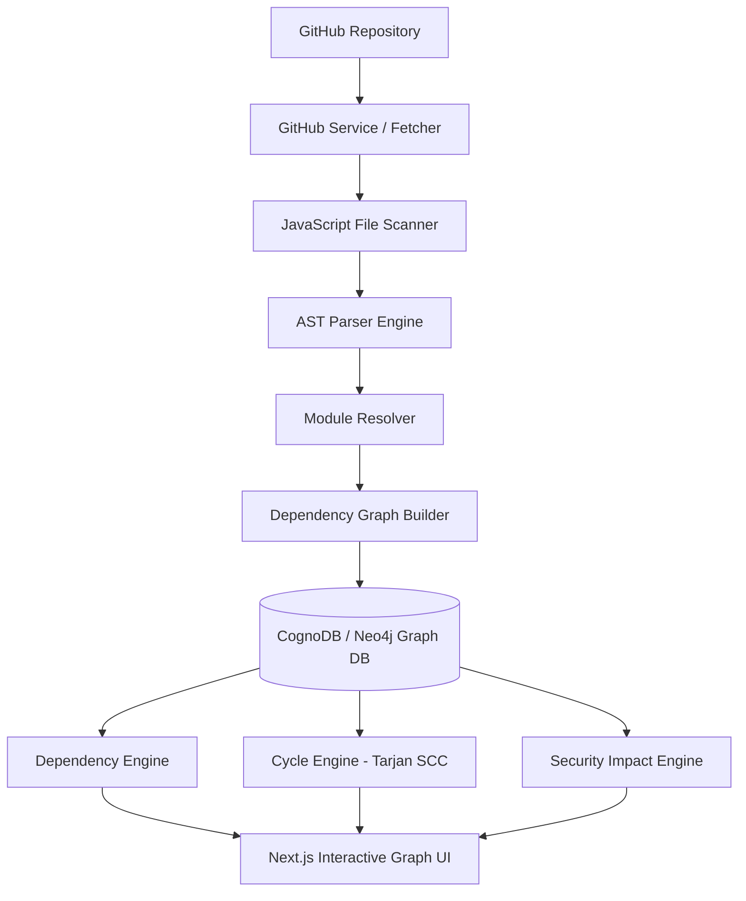
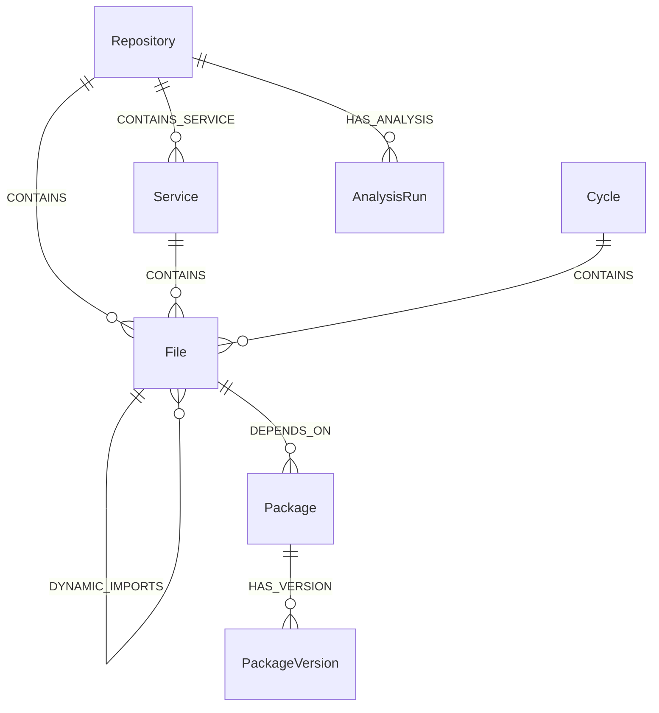

# NodeAtlas — Node.js Dependency Intelligence & Security Graph

**NodeAtlas** is a production-quality SaaS application that connects to a user's GitHub repository, analyzes its JavaScript/Node.js codebase, builds a persistent dependency graph in CognoDB, and provides three primary analysis modes: **Dependency Explorer**, **Cycle Analyzer**, and **Security Impact Analyzer**, plus a comprehensive **Packages Inventory**.

The graph database is the core product powering all intelligence modes, answering:
- **Dependencies:** What uses file X? What does file X depend on? What are the multi-hop dependency paths?
- **Cycles:** Where are circular dependencies? What is the complete loop `A → B → C → A`?
- **Security Impact:** If a user enters a package or service name as potentially infected/vulnerable, which downstream files and microservices depend on it, and what is the complete exposure graph?

---

## 🏗 System Architecture



---

## 📊 Graph Data Model

NodeAtlas models Node.js codebases as directed graphs:



### Nodes & Relationships
- `(:User)-[:OWNS]->(:Repository)`
- `(:Repository)-[:CONTAINS]->(:File)`
- `(:Repository)-[:CONTAINS_SERVICE]->(:Service)`
- `(:Service)-[:CONTAINS]->(:File)`
- `(:File)-[:IMPORTS | :REQUIRES | :DYNAMIC_IMPORTS]->(:File)`
- `(:File)-[:DEPENDS_ON]->(:Package)`
- `(:Package)-[:HAS_VERSION]->(:PackageVersion)`
- `(:Cycle)-[:CONTAINS]->(:File)`

---

## 🚀 Detailed Feature Guide & Capabilities

### 1. Dependency Explorer (`/explorer`)
- **What it is:** A visual 3D spherical node graph inspired by CognoDB Browser (`browser.cognodb.com`) that presents module relationships, imports, and service containment.
- **Capabilities:**
  - Interactive multi-hop graph exploration (`1`, `2`, or `3` hops).
  - Search toolbar to quickly highlight specific nodes.
  - Floating left sidebar panel displaying Node Labels (`:File`, `:Package`, `:PackageVersion`, `:Service`) and Relationship Edges (`DEPENDS_ON`, `IMPORTS`, `REQUIRES`, `HAS_VERSION`, `CONTAINS_SERVICE`).
  - Filter visibility by toggling node label buttons on and off.

### 2. Cycle Analyzer (`/cycles`)
- **What it is:** Identifies circular dependency loops using Tarjan's Strongly Connected Components (SCC) algorithm.
- **Why it matters:** Circular dependencies in Node.js can cause subtle runtime `undefined` require imports, unhandled stack overflows, and memory leaks.
- **Capabilities:**
  - Lists every circular dependency cycle detected in the codebase with step-by-step file loop order (e.g., `user-service.js → user-model.js → user-validator.js → user-service.js`).
  - Click **"Open Focused Cycle Graph"** to render an isolated visual graph where loop nodes are highlighted with emerald green **Cycle Start** and red **Cycle End** badges, with animated red relationship arrows.

### 3. Security Impact Analyzer (`/security`)
- **What it is:** An input-driven dependency exposure analyzer for package, service, or file targets.
- **Why it matters & What is the point?**
  - When a third-party npm package suffers a supply chain vulnerability, compromise, or breaking change, developers need to know: *"Which of our source files and microservices rely on this package directly or indirectly?"*
  - Instead of requiring active NVD/CVE API subscriptions, NodeAtlas lets users input any target package name (e.g., `lodash`, `axios`, `express`) or microservice and calculates reverse multi-hop dependency graph traversals.
- **Capabilities:**
  - Shows total count of exposed files and microservices affected.
  - Generates the complete exposure sub-graph.
  - Framed accurately around *"potentially affected"* / *"dependency exposure"* reachability.

### 4. Packages Inventory (`/packages`)
- **What it is:** A centralized directory of all external npm packages discovered during AST analysis of `import` / `require` statements and `package.json` manifests.
- **Why it matters & What is the point?**
  - Provides instant visibility into third-party code sprawl across microservice repositories.
  - Details usage counts (how many files import each package).
  - Includes direct action buttons to trigger **Security Impact Analysis** on any package with a single click.

---

## 🔑 How to Use NodeAtlas with User's Own GitHub Repositories

Follow these steps to analyze any public or private GitHub repository:

### Step 1: Generate a GitHub Personal Access Token (PAT)
1. Go to **GitHub Settings** > **Developer Settings** > **Personal Access Tokens** (Tokens classic or Fine-grained).
2. Create a token with `repo` scope (for private repositories) or `public_repo` scope (for public repositories).

### Step 2: Connect GitHub Token in NodeAtlas
1. Open NodeAtlas in your browser (`http://localhost:3000`).
2. In the navigation header, enter your GitHub Personal Access Token in the **"GitHub Personal Access Token"** input field.
3. Click **"Connect PAT"**. The status indicator will switch to **"PAT Connected"**.

### Step 3: Select and Analyze a Repository
1. Select a repository from your GitHub repositories dropdown list (or enter `owner/repo` format).
2. Click **"Analyze Repository"**.
3. NodeAtlas will fetch the complete file tree via GitHub REST API (`/git/trees/{branch}?recursive=1`), scan all JavaScript files (`.js`, `.mjs`, `.cjs`), run `@babel/parser` for static AST parsing, resolve module paths, and build the graph in CognoDB.
4. Once analysis completes, navigate to **Dependency Explorer**, **Cycle Analyzer**, **Security Impact**, or **Packages** to analyze your codebase.

---

## ⚡ Parameterized Cypher Queries

### Repository Multi-hop Graph Traversal
```cypher
MATCH (r:Repository {id: $repoId})-[:CONTAINS]->(f:File)
OPTIONAL MATCH (f)-[r_dep:IMPORTS|REQUIRES|DYNAMIC_IMPORTS]->(f2:File)
OPTIONAL MATCH (f)-[r_pkg:DEPENDS_ON]->(p:Package)
OPTIONAL MATCH (s:Service {repositoryId: $repoId})-[:CONTAINS]->(f)
RETURN f, r_dep, f2, r_pkg, p, s
```

### Security Target Multi-hop Reverse Traversal
```cypher
MATCH (p:Package {id: $packageName})<-[:DEPENDS_ON]-(f:File)<-[:IMPORTS|REQUIRES*1..5]-(dependentFile:File)
OPTIONAL MATCH (s:Service)-[:CONTAINS]->(dependentFile)
RETURN p, f, dependentFile, s
```

---

## 💻 Developer Guide & Local Setup

### Prerequisites
- Node.js `v18+` or `v20+`
- npm `v9+`

### Installation & Running Locally

1. **Clone and Install Dependencies**
   ```bash
   git clone <repo-url>
   cd nodeatlas
   npm install
   ```

2. **Configure Environment Variables** (Optional, defaults to high-performance in-memory graph store if database URI is omitted):
   ```env
   COGNODB_URI=bolt://localhost:7687
   COGNODB_USER=neo4j
   COGNODB_PASSWORD=password
   GITHUB_TOKEN=ghp_your_github_personal_access_token
   ```

3. **Run Unit & Integration Tests**
   ```bash
   npm test
   ```

4. **Start Development Server**
   ```bash
   npm run dev
   ```
   Open `http://localhost:3000` in your browser.

5. **Build for Production**
   ```bash
   npm run build
   npm run start
   ```

---

## 🧪 Demo Repository Included

NodeAtlas includes an embedded, realistic JavaScript microservices demo repository (`demo-repo/` / `ecommerce-microservices-demo`) containing:
- ~35 JavaScript source files across multiple service boundaries (`auth`, `users`, `orders`, `payments`, `utils`).
- 3 intentional circular dependency loops for cycle testing.
- Multiple external npm packages (`express`, `lodash`, `axios`, `dotenv`).
- **Demo Seed Toggle:** Use the `Demo Seed: ON/OFF` toggle in the header to populate or clear demo graph data at any time.

---

## 📌 Honest Limitations & Roadmap

### Initial MVP Scope Limitations
- **JavaScript Only:** Analyzes `.js`, `.mjs`, and `.cjs` files.
- **Static Analysis Only:** Repository code is **never executed** during analysis. Dynamic imports with runtime expressions (e.g. `require(varName)`) are recorded as unresolved dependencies.
- **Heuristic Service Discovery:** Microservices are discovered via folder boundary conventions (e.g. `services/*`, `apps/*`).
- **Exposure Checker:** Security Impact mode assesses dependency path reachability, not exploitability or CVE scanning.

### Future Roadmap
- TypeScript (`.ts`, `.tsx`) repository parser support
- OSV / NVD / GitHub Advisory CVE intelligence integration
- Automated Pull-Request comment bot
- Architecture drift detection & historical graph diffing
